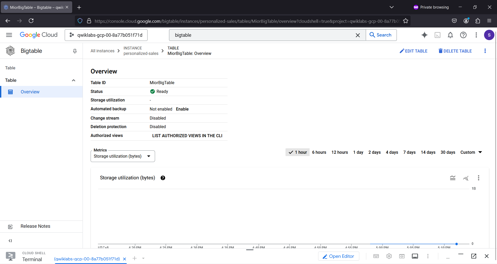
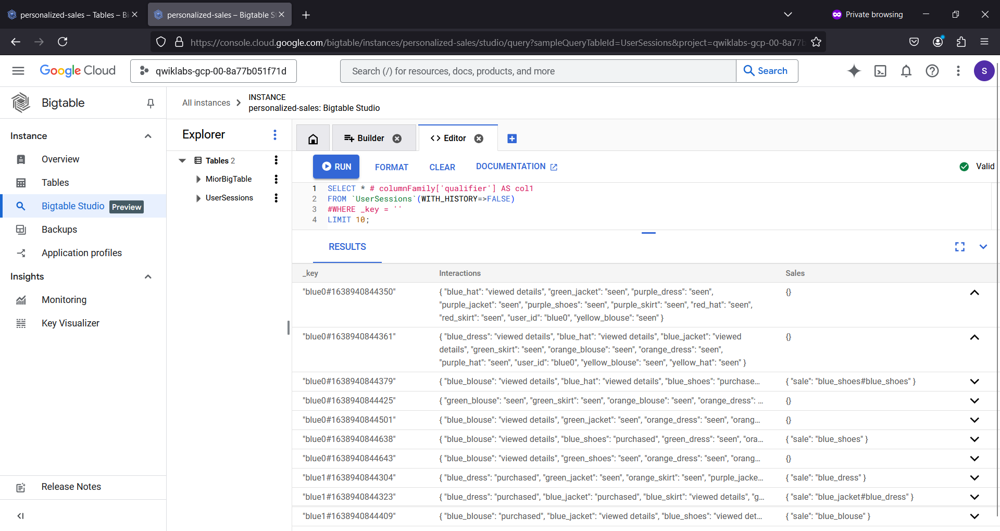
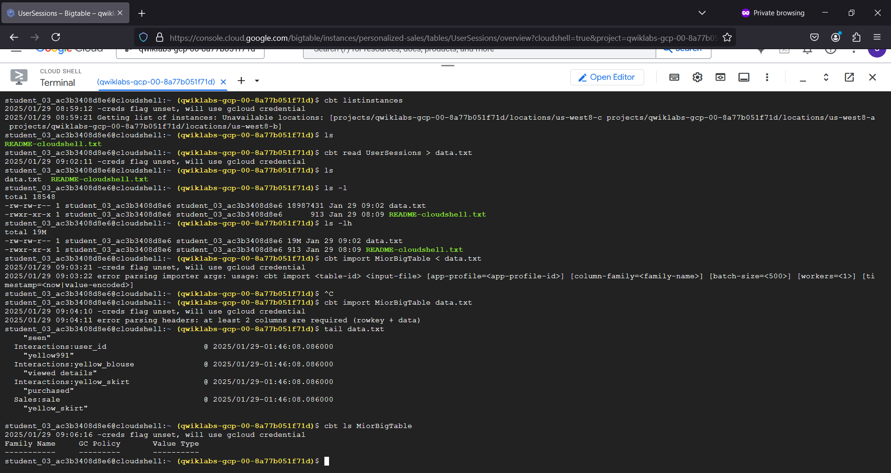
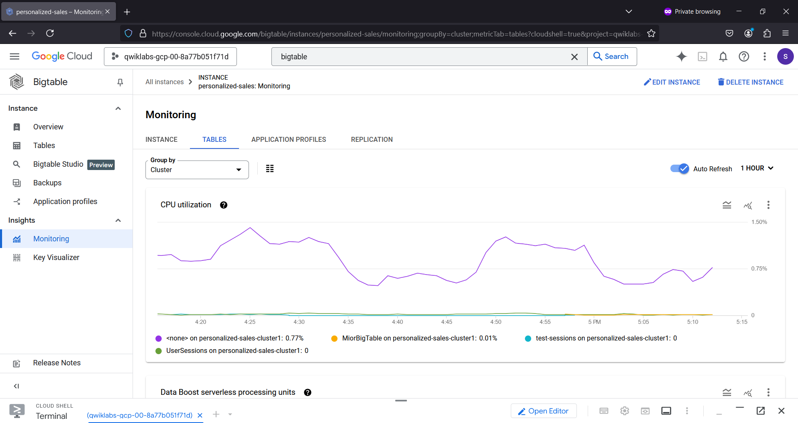
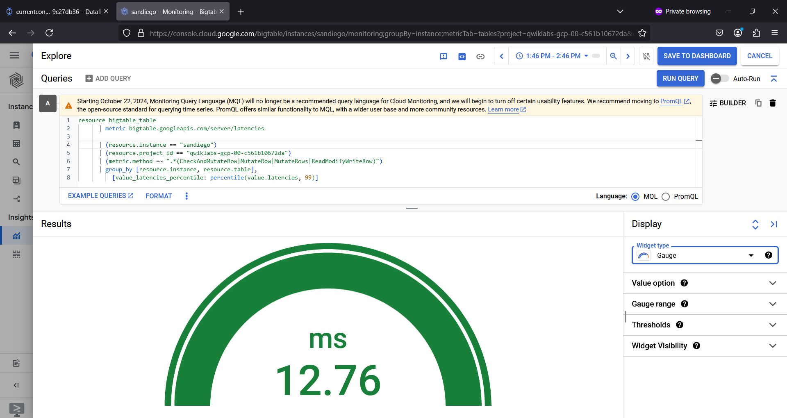
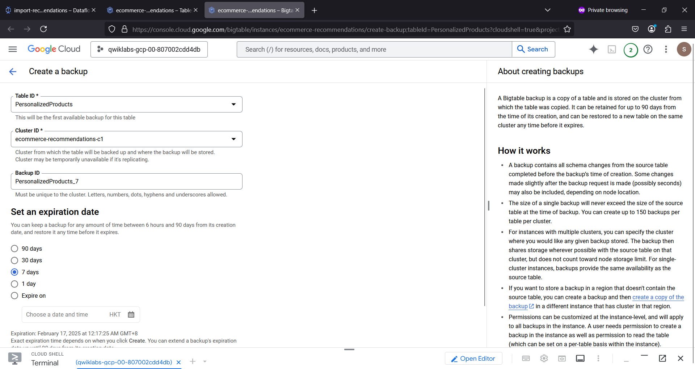
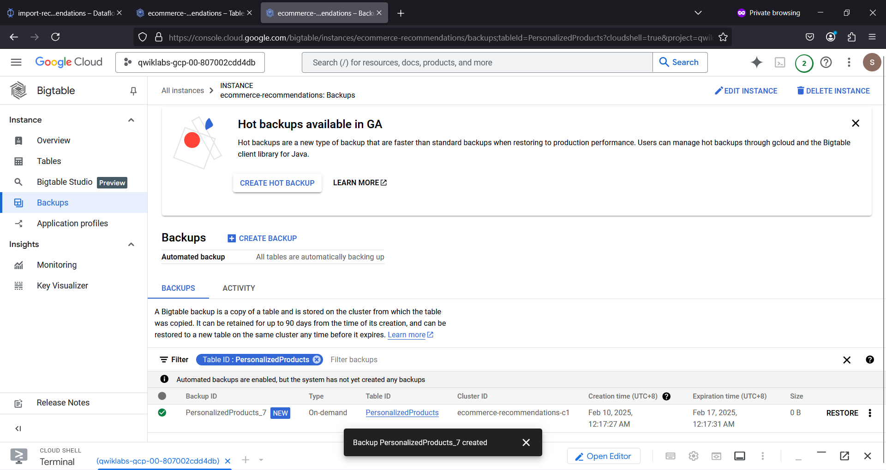

# bigtable 🌀
bigtable : #bigtable #gcp #nosql #backup #cbt

## Objective
To handle large-scale data workloads eg. key-value storage.
To acquire high throughput and low latency.

## Bigtable Database...

